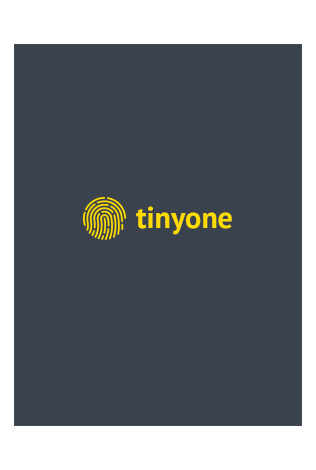

<!DOCTYPE html>
<html lang="en">
<html>
<head>
	<meta charset="utf-8">
	<meta name="viewport" content=" width=device-width,initial-scale=1.0">
	<title> Tinyone </title>

	<!--=======Favicon========-->

	<link rel="icon" href="images/logo.png">

	<!--=======Bootstrap Css========-->

	<link rel="stylesheet" href="https://stackpath.bootstrapcdn.com/bootstrap/4.5.0/css/bootstrap.min.css" integrity="sha384-9aIt2nRpC12Uk9gS9baDl411NQApFmC26EwAOH8WgZl5MYYxFfc+NcPb1dKGj7Sk" crossorigin="anonymous">

	<!--=======Main Css========-->

	<link rel="stylesheet" type="text/css" href="css/style.css">

	<!--=======Responsive Css========-->

	<link rel="stylesheet" type="text/css" href="css/responsive.css">

	
</head>
<body>
	 <!--=======Content Strat========-->

	 <!--=======Header Strat========-->

<header>
	

	 	

	 		

	 			

	 				

						
					

	 			

	            

	            	<nav class="tin-menu">
	            		<ul>
	            			<li><a href="#features">Features</a></li>
	            			<li><a href="">Support</a></li>
	            			<li><a href="">Blog</a></li>
	            			

	            				<i class="fas fa-bars"></i>
	            				 Menu
	            			

	            		</ul>
	            	</nav>
	            	

	            		<nav class="menu">
	            	   <ul>
	            		 <li><a href=""> home</a></li>
	            		 <li><a href=""> portfolio</a></li>
	            		 <li><a href=""> about</a></li>
	            		 <li><a href=""> contact</a></li>
	            	    </ul>
	            	    

	            	    	<i class="fas fa-window-close"></i>
	            	    Close
	            	    

	            	    
	                </nav> 
	            	

	            

	 		

	 	

	 

	 

	 	

	 		

	 			

	 				

						<h2>Inspire your inspiration</h2>
						<h5>Simple to use for your app, products showcase and your inspiration</h5>
						
Lorem ipsum dolor sit amet, consectetur adipisicing elit, sed do
						cillum dolore eu fugiat nulla pariatur. Excepteur sint occaecat cupidatat non
						proident, sunt in culpa qui officia deserunt mollit anim id est laborum.

					

					

						

						<i class="fab fa-apple"></i>
					   

					   

						<i class="fab fa-android"></i>
					   

					   

						<i class="fab fa-windows"></i>
					   

				     

	 			

	 			

	 				

	 					
	 				

	 			

	 		

	 	

	 
 
</header>       <!--=======Header End========-->

	               <!--=======Features Start========-->

	 <section class="tin-feature" id="features">
	 	

	 		

	 			<h2>Tinyone features</h2>
	 			<h5>Lorem ipsum dolor sit amet, consectetur adipisicing elit, sed do eiusmod
	 			tempor incididunt ut labore et dolore magna aliqua.consectetur adipisicing elitconsectetur adipisicing elit.</h5>
	 		

	 		

	 			

	 				

	 				   

	 				   	

	 				   		<i class="fas fa-mobile-alt"></i>
	 				   	

                         

                         	<h3> Fully Responsive</h3>
	 				   	    
Lorem ipsum dolor sit amet, consectetur adipisicing elit, sed do eiusmod
	 				   	    tempor incididunt ut labore et dolore magna aliqua.

                         

	 				   	 
	 				   

	 				

	 				

	 				   

	 				   	

	 				   		<i class="fas fa-layer-group"></i>
	 				   	

                         

                         	<h3>Fully Layered PSD</h3>
	 				   	    
Lorem ipsum dolor sit amet, consectetur adipisicing elit, sed do eiusmod
	 				   	    tempor incididunt ut labore et dolore magna aliqua.

                         

	 				   	 
	 				   

	 				

	 				

	 				   

	 				   	

	 				   		<i class="fab fa-font-awesome-flag"></i>
	 				   	

                         

                         	<h3>Font Awesome Icons</h3>
	 				   	    
Lorem ipsum dolor sit amet, consectetur adipisicing elit, sed do eiusmod
	 				   	    tempor incididunt ut labore et dolore magna aliqua.

                         

	 				   	 
	 				   

	 				

	 				

	 				   

	 				   	

	 				   		<i class="fas fa-code"></i>
	 				   	

                         

                         	<h3>HTML5 & CSS3</h3>
	 				   	    
Lorem ipsum dolor sit amet, consectetur adipisicing elit, sed do eiusmod
	 				   	    tempor incididunt ut labore et dolore magna aliqua.

                         

	 				   	 
	 				   

	 				

	 				

	 				   

	 				   	

	 				   		<i class="far fa-envelope"></i>
	 				   	

                         

                         	<h3>Email Template</h3>
	 				   	    
Lorem ipsum dolor sit amet, consectetur adipisicing elit, sed do eiusmod
	 				   	    tempor incididunt ut labore et dolore magna aliqua.

                         

	 				   	 
	 				   

	 				

	 				

	 				   

	 				   	

	 				   		<i class="fas fa-cloud-download-alt"></i>
	 				   	

                         

                         	<h3> Free to download</h3>
	 				   	    
Lorem ipsum dolor sit amet, consectetur adipisicing elit, sed do eiusmod
	 				   	    tempor incididunt ut labore et dolore magna aliqua.

                         

	 				   	 
	 				   

	 				

	 			
	 			

	 		

	 	

	 </section>      <!--=======Features End========-->
	 
	              <!--=======Footer Start========-->
	    <footer class="tin-footer">
	    	

	    		

	    			<h3>Keep in touch with us</h3>
	 			     <h5>Lorem ipsum dolor sit amet, consectetur adipisicing elit, sed do  
	 			        eiusmod
	 			       tempor incididunt ut labore et dolore magna aliqua.consectetur adipisicing elitconsectetur adipisicing elit.</h5>
	    		

	    		

	    			<input type="Email" name="email" placeholder="   Enter your email to update">
	    			<button>submit</button>
	    		

	    		

	    			<a href="#"><i class="fab fa-facebook-square"></i></a>
	    			<a href="#"><i class="fab fa-twitter-square"></i></a>
	    			<a href="#"><i class="fab fa-google-plus-square"></i></a>
	    			<a href="#"><i class="fab fa-pinterest-square"></i></a>
	    		

	    		

	    			

	    				

	    					

	    						HALOVIETNAM LTD  
                                     66, Dang Van ngu, Dong Da
                                     Hanoi, Vietnam. 
                                      contact@halovietnam.com  
                                      +844 35149182
	    					

	    				

	    				

                           

	    					  <a href="#">Examples</a>
	    					  <a href="#">Shop</a>
	    					  <a href="#">License</a>
	    					
	
	    				

	    				

	    					

	    						<a href="#">Contact</a>
	    						<a href="#">About</a>
	    						<a href="#">Privacy</a>
	    						<a href="#">Terms</a>
	    					

                        

                        

                        	

                        		<a href="#">Download</a>
	    						<a href="#">Support</a>
	    						<a href="#">Documents</a>
                        	

                        

                        

                        	

                        		<a href="#">Media</a>
	    						<a href="#">Blog</a>
	    						<a href="#">Forums</a>
                        	

                        

	    			

	    		

	    	

	    </footer>          
	 
	

    <!--=======Content End========-->
   <!--=======jQuery.com========-->

   

   <!--=======Font Awesome========-->

   
   
  
   <!--=======custom js========-->

   

</body>
</html>
